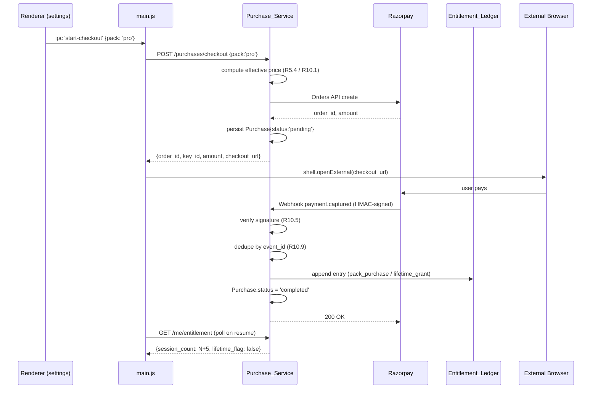

# Design Document

## Overview

The Credits and Subscription System turns the existing local-only Interview Assistant Electron app into a productized, server-brokered application sold as one-time **Interview Session Packs** for the Indian market. Provider API keys move from end-user machines into a centrally managed, encrypted server-side store. End users authenticate, purchase Packs through Razorpay, and consume **Interview Sessions** (90-minute windows of unlimited AI usage across Manual, Passive, and Screen Analyzer modes) brokered by a server-side **AI Proxy** that holds upstream provider credentials.

The design is shaped by three forces:

1. **Strict, append-only billing semantics.** Entitlement (remaining sessions, lifetime flag) is derived from an immutable ledger so refunds, audits, and disputes are always reconstructible. This drives a Postgres-backed event-sourced model rather than a mutable counter.
2. **Cost-aware hosting (Requirement 15).** The architecture must run on a single Postgres instance and a single serverless function platform, with no always-on workers. This rules out long-lived processes and pushes work to scheduled invocations and inline computation.
3. **Minimal disruption to the existing Electron client.** The current main-process IPC handlers (`call-ai-stream`, `call-gemini-api`, `transcribe-audio`, `capture-screen-frame`, `read-active-window`) already encapsulate every direct provider HTTPS call. Replacing the destination URL and adding a Bearer token is sufficient to reroute traffic through the AI Proxy. Renderer code and the three modes (Manual, Passive, Screen Analyzer) are largely preserved.

### Research Notes

- **Razorpay Orders + Webhooks pattern.** Razorpay's standard checkout flow creates an Order server-side, redirects the user to a hosted checkout URL or in-page widget, and sends asynchronous webhooks (`payment.captured`, `payment.failed`) signed with HMAC-SHA256 using a shared webhook secret. Funds are credited only on signature-verified `payment.captured`. Source: [Razorpay Webhooks documentation](https://razorpay.com/docs/webhooks/).
- **Supabase free tier limits.** Supabase free tier provides 500 MB Postgres storage, 1 GB egress, and built-in Auth + Row Level Security. This satisfies Requirement 15 for the first ~1000 users when blob payloads (audio uploads) are offloaded to Supabase Storage with a short retention. Source: [Supabase pricing](https://supabase.com/pricing).
- **Cloudflare Workers / Vercel free tier.** Both offer zero-cost-at-rest serverless compute with sufficient request quotas for early-stage usage. Cloudflare Workers also offer Durable Objects for cheap rate-limit counters; Vercel pairs cleanly with Supabase for full-stack TypeScript. The design treats the serverless platform as interchangeable behind a thin HTTP framework (Hono or Fastify-on-Edge).
- **Electron secure storage.** Electron exposes `safeStorage` (backed by Windows DPAPI / macOS Keychain / libsecret on Linux) for encrypting tokens at rest. This is the recommended target for Refresh_Tokens per Requirement 13.4. Source: [Electron safeStorage](https://www.electronjs.org/docs/latest/api/safe-storage).
- **Append-only ledger pattern.** Modeling entitlement as `SUM(session_delta)` with a `CHECK` constraint and a per-user advisory lock (or `SELECT ... FOR UPDATE` on a singleton row) is a well-known pattern for serializing concurrent decrements without negative balances. PostgreSQL's `pg_advisory_xact_lock(user_id)` is sufficient and scales within free tier connection limits.
- **Certificate pinning in Electron.** Electron's `session.setCertificateVerifyProc` allows custom pinning logic; pinning the leaf or intermediate SPKI SHA-256 hash is the standard approach (RFC 7469 style). Source: [Electron session.setCertificateVerifyProc](https://www.electronjs.org/docs/latest/api/session).

## Architecture

### High-Level Topology

```mermaid
graph TB
    subgraph Desktop["Electron Desktop_Client"]
        Main["main.js<br/>(IPC handlers)"]
        Renderer["renderer/index.html<br/>(Manual / Passive / Screen Analyzer)"]
        Settings["renderer/settings.html<br/>(End-user settings, no API keys)"]
        SecureStore["safeStorage<br/>(Refresh_Token, client_id)"]
    end

    subgraph Backend["Backend_API (Serverless)"]
        Auth["Auth_Service<br/>/auth/*"]
        Purchase["Purchase_Service<br/>/packs, /purchases/*"]
        Session["Session_Service<br/>/sessions/*"]
        Entitlement["Entitlement_Ledger<br/>(append-only)"]
        AIProxy["AI_Proxy<br/>/ai/text /ai/vision /ai/audio"]
        Usage["Usage_Service<br/>/me/usage, /admin/usage"]
        RateLimit["Rate_Limit middleware"]
        Audit["Audit_Log"]
        Scheduler["Scheduled tasks<br/>(session expiry, reconciliation)"]
    end

    subgraph Storage["Persistence (Supabase free tier)"]
        PG[("Postgres<br/>users, sessions,<br/>ledger, purchases,<br/>audit, usage")]
        Blob[("Object Storage<br/>audio blobs<br/>(7-day TTL)")]
        Secrets[("KMS / env<br/>master encryption key,<br/>Razorpay secrets")]
    end

    subgraph External["External Services"]
        RZP["Razorpay<br/>(Orders + Webhooks)"]
        Providers["Gemini / Groq<br/>DeepSeek / Cerebras / Whisper"]
        Mail["Email provider<br/>(verification + password reset)"]
    end

    subgraph AdminUI["Admin_Dashboard (browser)"]
        Dash["Web app<br/>users, packs, keys,<br/>welcome offer, ledger"]
    end

    Main -->|HTTPS + Bearer + client_id| Auth
    Main -->|HTTPS + Bearer + client_id| Session
    Main -->|HTTPS + Bearer + client_id| AIProxy
    Main -->|HTTPS + Bearer + client_id| Purchase
    Renderer -.IPC.-> Main
    Settings -.IPC.-> Main
    Main --- SecureStore

    Auth --> PG
    Purchase --> PG
    Session --> PG
    Entitlement --> PG
    Usage --> PG
    Audit --> PG
    AIProxy --> Entitlement
    AIProxy --> Usage
    AIProxy --> Providers
    AIProxy --> Blob
    Purchase -->|Create Order| RZP
    RZP -->|Webhook| Purchase
    Auth --> Mail
    AIProxy --> Secrets
    Purchase --> Secrets

    Dash -->|HTTPS + admin Bearer| Auth
    Dash --> Purchase
    Dash --> Session
    Dash --> Entitlement
    Dash --> Audit

    Scheduler --> Session
    Scheduler --> Purchase
```



### Request Flow: Authenticated AI Operation

```mermaid
sequenceDiagram
    participant R as Renderer (mode UI)
    participant M as main.js (IPC)
    participant API as AI_Proxy
    participant S as Session_Service
    participant L as Entitlement_Ledger
    participant U as Usage_Service
    participant P as Provider (Gemini/Groq/etc.)

    R->>M: ipcRenderer.invoke('call-ai-stream', {...})
    M->>M: attach Session_Token, client_id, build_version,<br/>idempotency_key
    M->>API: POST /ai/text (stream)
    API->>API: validate Session_Token (R7.2)
    API->>S: getActiveSession(user_id)
    alt no active session
        S-->>API: null
        API-->>M: 402 no_active_session
        M-->>R: error → show "Start a Session"
    else active session
        S-->>API: session_id, expires_at
        API->>API: rate limit check (R12.1)
        API->>API: idempotency lookup (R7.6/7.7)
        API->>P: forward request (with server-held key)
        loop streaming chunks
            P-->>API: chunk
            API-->>M: SSE chunk
            M-->>R: ai-stream-chunk
        end
        API->>U: insert Usage row (R9.1)
    end
```



### Request Flow: Pack Purchase



### Architectural Decisions

| Decision | Rationale | Alternatives considered |
|---|---|---|
| Backend hosted as a single serverless function on Cloudflare Workers or Vercel, fronting Supabase Postgres | Satisfies Requirement 15 (free tier, no always-on worker). | Long-running Node service on Render/Fly.io — rejected: paid tier required for non-sleeping app. |
| Entitlement modeled as an append-only ledger; current balance is `SUM(session_delta)` clamped to ≥ 0 | Required by Requirement 6.1/6.6 (append-only) and enables reliable audits and refunds. | Mutable counter on user row — rejected: violates 6.6 and gives no history. |
| Per-user serialization for session start uses Postgres `pg_advisory_xact_lock(user_id)` inside the same transaction that inserts the ledger entry and the `interview_sessions` row | Single round-trip serialization that prevents two concurrent decrements producing a negative balance, and prevents two concurrent `active` rows for the same user. | DB-level row lock on a singleton balance row — rejected: balance is computed, not stored. |
| Provider keys encrypted with AES-256-GCM using a key derived (HKDF-SHA256) from a server-held master secret stored in the platform's secret manager | Meets Requirement 4.2; rotation via incrementing version counter (R4.4). | Storing a single static AES key in the database — rejected: master must be outside DB. |
| Razorpay integration uses Orders + Webhooks rather than client-side capture | Idempotent, signature-verified, replayable via event_id dedupe. Required by Requirement 10. | Client confirms payment to backend — rejected: trivially forgeable. |
| Idempotency for AI requests keyed by `(user_id, idempotency_key)` with a 24-hour cache row storing the response and a SHA-256 of the canonical request payload | Implements Requirement 7.6/7.7 with conflict detection. | Trust client retries — rejected: causes duplicate provider charges. |
| Rate limiting in Postgres using a small `rate_events` table with rolling windows computed by `count(*) WHERE ts > now() - interval` plus an index on `(user_id, ts)` | Avoids paid Redis. Cheap at low scale; the table is partitioned/pruned weekly. | Cloudflare Durable Objects — viable on CF Workers; design supports either via a `RateLimitStore` interface. |
| Streaming preserved end-to-end (provider → Worker → Electron) using Server-Sent Events | Reuses the renderer's existing token-by-token rendering and IPC `ai-stream-chunk` event — minimal client churn. | Buffer entire response — rejected: degrades UX vs. current behavior. |
| Desktop client uses an Electron-side HTTP client wrapper that always attaches `Authorization`, `X-Client-Id`, `X-Build-Version`, and (when present) `Idempotency-Key` headers | Centralizes Requirement 13.1/13.6 enforcement. | Per-call header attachment — rejected: easy to forget, error-prone. |
| Hosting mode switch `MODE = free | paid` reads at startup and selects connection strings; no code path branches at request time | Requirement 15.6 (config-only switch, no redeploy). | Build-time flag — rejected: requires rebuild. |

## Components and Interfaces

The design splits into three top-level components: the **Backend API**, the **Desktop Client (Electron)**, and the **Admin Dashboard**.

### Backend API

The Backend is a single deployable function that mounts these subsystem routes. All routes return JSON, accept `application/json`, and require headers `Authorization: Bearer <Session_Token>` (except `/auth/*`, `/packs`, `/webhooks/razorpay`), `X-Client-Id`, and `X-Build-Version`.

#### Auth_Service — `/auth/*`

| Endpoint | Body | Response | Notes |
|---|---|---|---|
| `POST /auth/register` | `{email, password}` | `{user_id, status:'pending_verification'}` | R1.3, R1.9. Password hashed with Argon2id (m=64MB, t=3, p=1). |
| `POST /auth/verify-email` | `{token}` | `{verified: true}` | Token: random 32-byte URL-safe; 24-hour TTL. |
| `POST /auth/resend-verification` | `{email}` | `{sent: true}` | Rate-limited to 3 per hour per email. |
| `POST /auth/login` | `{email, password, client_id}` | `{access_token, refresh_token, expires_in, role}` | R1.2, R1.5 (5/15min lockout). Stores `(refresh_token_hash, client_id)` server-side for R13.5. |
| `POST /auth/refresh` | `{refresh_token}` | `{access_token, expires_in}` | R1.6. Rejects if revoked or `client_id` mismatch (R13.5). |
| `POST /auth/logout` | `{refresh_token}` | `{ok: true}` | R1.7. Revokes refresh token row. |
| `POST /auth/password-reset/request` | `{email}` | `{sent: true}` | Returns 200 regardless of existence (R6 disclosure-safe). |
| `POST /auth/password-reset/confirm` | `{token, new_password}` | `{ok: true}` | Token TTL 60 min. |

Tokens are JWTs signed with HS256 using a server secret. Claims: `sub` (user_id), `role`, `client_id`, `iat`, `exp`, `jti`. Refresh tokens are opaque random strings stored hashed with their bound `client_id`.

#### Purchase_Service — `/packs`, `/purchases/*`

| Endpoint | Auth | Notes |
|---|---|---|
| `GET /packs` | end-user | Returns active packs with per-user `effective_price` (R5.4). |
| `POST /purchases/checkout` | end-user | `{pack_slug}` → creates Razorpay Order, returns `{order_id, key_id, amount, currency:'INR', checkout_url}` (R10.1). |
| `GET /me/purchases` | end-user | R10.12. Reverse-chron list. |
| `POST /webhooks/razorpay` | none (signed) | R10.5–R10.10. HMAC-SHA256 verification, event_id dedupe. |
| `GET /admin/packs` / `PATCH /admin/packs/:slug` | admin | R5.5–R5.10, R11.6. |
| `GET /admin/welcome-offer` / `PATCH /admin/welcome-offer` | admin | R5.7, R5.10, R11.8. |

#### Session_Service — `/sessions/*`

| Endpoint | Auth | Notes |
|---|---|---|
| `POST /sessions/start` | end-user | R8.1. Single transaction: advisory lock → check entitlement → insert ledger entry → insert `interview_sessions` row. |
| `POST /sessions/:id/end` | end-user | R8.6. Sets status=`ended`, `ended_at`. No refund. |
| `GET /me/session/active` | end-user | R8.7. Returns active session or 404. |

#### AI_Proxy — `/ai/*`

| Endpoint | Auth | Notes |
|---|---|---|
| `POST /ai/text` (`text/event-stream`) | end-user, active session | Mirrors current Groq/DeepSeek/Cerebras/Gemini text completion. Streams chunks as `data: {"delta":"..."}`. |
| `POST /ai/vision` (`text/event-stream`) | end-user, active session | Multimodal text+image. Inputs: `messages` with `image_url` data URLs (existing format from `main.js`). |
| `POST /ai/audio` | end-user, active session | `multipart/form-data` audio; returns `{text}` (Whisper). Audio blob stored with 7-day TTL (R15.2). |

All `/ai/*` requests accept `Idempotency-Key` (UUIDv4, optional but client-recommended). Provider routing is internal: the request body specifies a `model` slug; the AI_Proxy resolves it to a provider via the catalog and looks up the matching `Provider_Key`.

#### Usage_Service — `/me/usage`, `/admin/usage`

| Endpoint | Auth | Notes |
|---|---|---|
| `GET /me/usage?from=&to=&cursor=&page_size=` | end-user | R9.2–R9.5. Default 30 days, max 92, max page 200. |
| `GET /admin/usage?from=&to=` | admin | R9.6. Returns aggregated counts grouped by user, op type, day. |

#### Admin endpoints — `/admin/*`

`/admin/users`, `/admin/users/:id`, `/admin/users/:id/entitlement-adjust`, `/admin/users/:id/role`, `/admin/provider-keys`, `/admin/audit-log`, `/admin/rate-limits/:user_id`. All gated by `role=admin` claim (R2.2/R2.3).

#### Cross-Cutting Middleware

```mermaid
flowchart LR
    Req[Incoming request] --> CertPin[TLS pinning<br/>(client side)]
    CertPin --> Headers{X-Client-Id<br/>X-Build-Version<br/>present + valid?}
    Headers -- no --> H400[400 missing_client_id<br/>or 426 client_upgrade_required]
    Headers -- yes --> Auth{Token check}
    Auth -- public route --> Route
    Auth -- bearer present --> Verify{JWT valid?<br/>client_id match?}
    Verify -- no --> H401[401 unauthenticated<br/>or client_id_mismatch]
    Verify -- yes --> Role{role required?}
    Role -- needs admin --> RoleCheck{role == admin?}
    RoleCheck -- no --> H403[403 forbidden_role]
    RoleCheck -- yes --> RL
    Role -- end-user --> RL[Rate_Limit check]
    RL -- exceeded --> H429[429 rate_limited<br/>Retry-After: N]
    RL -- ok --> Route[Handler]
    Route --> Resp[Response + structured log]
```

### Desktop Client (Electron)

The existing entry points (`src/main.js`, `src/preload.js`, `src/renderer/index.html`, `src/renderer/settings.html`, `src/screen-reader.js`) are preserved with surgical changes.

#### Modified files

- **`src/main.js`** — Replace `https.request` to `api.groq.com`, `api.deepseek.com`, `api.cerebras.ai`, `generativelanguage.googleapis.com` with calls to a new internal helper `backendRequest(path, opts)` that targets the configured Backend_API base URL and attaches all required headers. The IPC handlers `call-ai-stream`, `call-gemini-api`, `call-deepseek-api`, `call-ai-api`, and `transcribe-audio` keep their IPC channel names — only their bodies are replaced. This means renderer code does not change.
- **`src/preload.js`** — Add a thin `interviewAssistantApi` object exposing `auth`, `session`, `purchase`, and `entitlement` operations as IPC invocations. The current full `ipcRenderer` exposure is retained for backward compatibility through one release cycle, then removed.
- **`src/renderer/settings.html`** — Remove all provider API key inputs (Groq, Gemini, DeepSeek, Cerebras). Add: account info card (email, role, remaining sessions / lifetime badge), "Buy More Sessions" button, sign-out button, "Open Admin Dashboard" link visible only when `role === 'admin'` (R3.5/R3.6). Resume context, job context, and model preference selector remain.
- **`src/renderer/index.html`** — Add a top-of-window session badge: countdown timer (R8.8), "Start Interview Session" CTA shown when no active session (R16.1), and "End Session" button shown when active. Mode tabs are disabled when no session is active.
- **`src/screen-reader.js`** — Unchanged. Active-window text reading remains a local main-process operation.

#### New files

- **`src/auth/auth-controller.js`** — Owns the `Session_Token` lifecycle. Reads/writes refresh token via `safeStorage`; refreshes proactively at 80% of token TTL; on refresh failure, clears local state and emits `auth:logged-out` to the renderer (R1.10).
- **`src/auth/secure-store.js`** — Wraps `safeStorage` with a fallback to a `0600` JSON file under `app.getPath('userData')` for non-Electron-secure-store platforms (R13.4).
- **`src/auth/client-id.js`** — Generates and persists a v4 UUID per install (R13.1).
- **`src/net/backend-client.js`** — Centralized HTTP client. Attaches headers; handles 401→refresh→retry; surfaces structured errors `{code, message, retry_after?}`.
- **`src/net/cert-pinner.js`** — Installs a `session.setCertificateVerifyProc` that hashes the leaf and intermediate SPKI and matches against pins in a build-time constant (R13.3).
- **`src/session/session-controller.js`** — Tracks active session (id, expires_at), exposes `start()`, `end()`, `getRemainingSeconds()`. Emits `session:state-changed` to the renderer at most every 10 seconds (R8.8).
- **`src/billing/checkout-controller.js`** — Calls `POST /purchases/checkout`, opens checkout URL via `shell.openExternal` (R10.3), polls entitlement on app focus (R10 backend completes via webhook).
- **`src/migration/legacy-config-migrator.js`** — On startup, loads `~/.interview-assistant-config.json`; if any provider key field is present, removes those fields, rewrites the file, and queues a deletion-event to send to the Backend on first connection (R3.2/R3.3).

#### Renderer event surface (preload)

```js
// exposed via preload.js as window.interviewAssistantApi
interviewAssistantApi = {
  auth: {
    register({email, password}),
    login({email, password}),
    logout(),
    onAuthChanged(handler),         // 'logged-in' | 'logged-out' | 'pending-verification'
    getCurrentUser(),               // {user_id, email, role} | null
  },
  entitlement: {
    get(),                          // {session_count, lifetime_flag}
    onChanged(handler),
  },
  session: {
    start(),                        // returns {session_id, expires_at} or {error}
    end(),
    getActive(),                    // {session_id, expires_at, remaining_seconds} | null
    onStateChanged(handler),        // tick every ≤10s
  },
  purchase: {
    listPacks(),                    // [{slug, name, mrp, effective_price, session_count, lifetime, welcome_applies}]
    checkout(packSlug),             // opens external browser, returns {order_id}
    listMine(),
  },
  ai: {
    callText({messages, model, systemPrompt, idempotencyKey}),
    callVision({messages, model, systemPrompt, idempotencyKey}),
    transcribeAudio({audioBase64, model}),
    onStreamChunk(handler),         // existing event 'ai-stream-chunk' renamed via wrapper
  },
  config: {
    save({resumeContext, jobContext, modelPreference}),
    load(),
  }
};
```

### Admin Dashboard

A separate, browser-based React (or SvelteKit) app deployed alongside the Backend (or as a static asset on the same Worker). Backed by the same Backend API with `role=admin` JWTs. Pages:

- **Sign-in** — same `/auth/login`, requires `role=admin` to proceed.
- **Users** — paginated list with filters; user detail shows purchases, sessions, ledger, current entitlement (R11.1/R11.2). Inline grant/revoke modal (R11.3/R11.4) and lifetime grant (R11.5).
- **Pricing & Packs** — table with inline edit, computed discount %, validation (R5.8/R5.9, R11.6/R11.7).
- **Welcome Offer** — toggle + datetime picker, confirmation dialog (R5.10).
- **Provider Keys** — masked list, create / rotate / delete (R4.1, R4.3, R11.9).
- **Audit Log** — read-only paginated view.
- **Rate Limit Overrides** — per-user numeric overrides (R12.4).

## Data Models

All persistent state lives in Postgres. Schemas use `uuid` primary keys, `timestamptz` for timestamps, and reject deletes / updates on append-only tables via row-level security policies plus revoked grants for the application role.

### `users`

```
id                uuid PK
email             citext UNIQUE NOT NULL  -- max 254 chars
password_hash     text NOT NULL           -- Argon2id encoded
role              text NOT NULL CHECK (role IN ('user','admin'))
email_verified_at timestamptz NULL
locked_until      timestamptz NULL
failed_login_count int NOT NULL DEFAULT 0
created_at        timestamptz NOT NULL DEFAULT now()
```

Bootstrap admin (R2.4) is enforced by an after-insert trigger: if `(SELECT count(*) FROM users WHERE role='admin') = 0` at insert time, the inserted row's role is forced to `admin` and an `audit_log` entry with reason `bootstrap_admin` is appended in the same transaction.

### `refresh_tokens`

```
id              uuid PK
user_id         uuid REFERENCES users(id)
token_hash      text NOT NULL          -- SHA-256 of refresh token
client_id       uuid NOT NULL          -- bound at issuance (R13.5)
expires_at      timestamptz NOT NULL
revoked_at      timestamptz NULL
created_at      timestamptz NOT NULL DEFAULT now()
```

### `email_verifications`, `password_resets`

```
id          uuid PK
user_id     uuid REFERENCES users(id)
token_hash  text NOT NULL
expires_at  timestamptz NOT NULL
used_at     timestamptz NULL
```

### `packs` (Pack_Catalog)

```
slug             text PK CHECK (slug IN ('starter','pro','lifetime'))
display_name     text NOT NULL CHECK (length(display_name) BETWEEN 1 AND 50)
description      text NOT NULL CHECK (length(description) BETWEEN 1 AND 500)
mrp_paise        bigint NOT NULL CHECK (mrp_paise > 0 AND mrp_paise <= 100000000)
welcome_price_paise bigint NOT NULL CHECK (welcome_price_paise >= 0 AND welcome_price_paise < mrp_paise)
session_count    int NULL CHECK (session_count IS NULL OR session_count > 0)
is_lifetime      boolean NOT NULL DEFAULT false
active           boolean NOT NULL DEFAULT true
updated_at       timestamptz NOT NULL DEFAULT now()
CONSTRAINT lifetime_xor_count CHECK (
  (is_lifetime AND session_count IS NULL)
  OR (NOT is_lifetime AND session_count IS NOT NULL)
)
```

### `welcome_offer` (singleton)

```
id           int PK CHECK (id = 1)        -- singleton row
enabled      boolean NOT NULL
ends_at      timestamptz NOT NULL
created_at   timestamptz NOT NULL
updated_at   timestamptz NOT NULL
```

### `purchases`

```
id                   uuid PK
user_id              uuid REFERENCES users(id)
pack_slug            text REFERENCES packs(slug)
effective_price_paise bigint NOT NULL
mrp_at_purchase_paise bigint NOT NULL
status               text NOT NULL CHECK (status IN ('pending','completed','failed'))
razorpay_order_id    text UNIQUE NOT NULL
razorpay_payment_id  text UNIQUE NULL
welcome_offer_applied boolean NOT NULL
created_at           timestamptz NOT NULL DEFAULT now()
completed_at         timestamptz NULL
```

### `razorpay_events` (webhook dedupe)

```
event_id     text PK              -- Razorpay event id
event_type   text NOT NULL
order_id     text NULL
payment_id   text NULL
received_at  timestamptz NOT NULL DEFAULT now()
processed   boolean NOT NULL DEFAULT false
unmatched    boolean NOT NULL DEFAULT false   -- R10.10
raw_payload  jsonb NOT NULL
```

### `entitlement_ledger` (append-only)

```
id              uuid PK
user_id         uuid REFERENCES users(id)
ts              timestamptz NOT NULL DEFAULT clock_timestamp()
session_delta   int NOT NULL CHECK (session_delta BETWEEN -1000000 AND 1000000 AND session_delta <> 0
                                    OR (session_delta = 0 AND reason = 'session_start'))
lifetime_flag_set text NOT NULL CHECK (lifetime_flag_set IN ('unchanged','set_true'))
reason          text NOT NULL CHECK (reason IN
                  ('pack_purchase','lifetime_grant','session_start',
                   'session_refund','admin_adjustment'))
razorpay_payment_id text NULL
interview_session_id uuid NULL
acting_admin_id uuid NULL REFERENCES users(id)
resulting_session_count int NOT NULL CHECK (resulting_session_count >= 0)
resulting_lifetime_flag boolean NOT NULL
note            text NULL CHECK (note IS NULL OR length(note) <= 500)
```

Updates and deletes are revoked at the role level. The `resulting_*` columns are computed and written by the inserting transaction (after the advisory lock). They are denormalized for fast `GET /me/entitlement` (R6.4) — the canonical source of truth remains the `SUM`/lifetime derivation in Requirement 6.2; a periodic invariant check (Requirement 14 audit job) verifies they agree.

### `interview_sessions`

```
id          uuid PK
user_id     uuid REFERENCES users(id)
status      text NOT NULL CHECK (status IN ('active','ended','expired'))
started_at  timestamptz NOT NULL
expires_at  timestamptz NOT NULL
ended_at    timestamptz NULL
ended_reason text NULL CHECK (ended_reason IN ('ended_by_user','expired','signed_out'))
```

A partial unique index `CREATE UNIQUE INDEX one_active_session_per_user ON interview_sessions(user_id) WHERE status='active'` enforces Requirement 8.3 / Single Active Session Invariant.

### `provider_keys`

```
provider     text PK CHECK (provider IN ('gemini','groq','deepseek','cerebras'))
ciphertext   bytea NOT NULL          -- AES-256-GCM
nonce        bytea NOT NULL          -- 12 bytes
auth_tag     bytea NOT NULL          -- 16 bytes
last4        text NOT NULL CHECK (length(last4) = 4)
version      int NOT NULL DEFAULT 1
created_at   timestamptz NOT NULL DEFAULT now()
updated_at   timestamptz NOT NULL DEFAULT now()
```

### `usage`

```
id               uuid PK
user_id          uuid
session_id       uuid REFERENCES interview_sessions(id)
ts               timestamptz NOT NULL
operation_type   text NOT NULL CHECK (operation_type IN ('text','vision','audio'))
model_id         text NOT NULL
input_tokens     int NULL
input_image_count int NULL
output_tokens    int NULL
status           text NOT NULL CHECK (status IN ('success','failed'))
upstream_http_status int NULL
idempotency_key  uuid NULL
```

Index `(user_id, ts DESC)` for user history, `(ts)` for admin aggregation.

### `idempotency_cache`

```
user_id          uuid
idempotency_key  uuid
request_hash     bytea NOT NULL          -- SHA-256 of canonical request
response_body    jsonb NOT NULL
created_at       timestamptz NOT NULL DEFAULT now()
expires_at       timestamptz NOT NULL    -- created_at + 24h
PRIMARY KEY (user_id, idempotency_key)
```

A scheduled job (every 60 minutes) deletes rows where `expires_at < now()`.

### `rate_events`

```
user_id    uuid
ts         timestamptz NOT NULL
kind       text CHECK (kind IN ('ai_op','session_start','login_attempt','login_success'))
ip         inet NULL
PRIMARY KEY (user_id, ts, kind)
```

Index `(user_id, kind, ts DESC)`. Pruned weekly to last 30 days.

### `rate_limit_overrides`

```
user_id     uuid PK
ai_per_min  int NULL CHECK (ai_per_min IS NULL OR ai_per_min BETWEEN 0 AND 100000)
ai_per_day  int NULL
session_per_hour int NULL
updated_at  timestamptz NOT NULL DEFAULT now()
```

### `audit_log`

```
id           uuid PK
ts           timestamptz NOT NULL DEFAULT clock_timestamp()
actor_user_id uuid NULL                  -- NULL for 'anonymous'
target_user_id uuid NULL
target_resource text NULL                -- e.g. 'pack:pro', 'provider_key:gemini'
event_type   text NOT NULL                -- enum mirroring R14.4 set
outcome      text NOT NULL CHECK (outcome IN ('success','failure'))
reason_code  text NULL
metadata     jsonb NOT NULL DEFAULT '{}'::jsonb
```

Updates / deletes are revoked at the role level (R14.5). Retention ≥ 24 months.

### `unmatched_webhooks`

A view over `razorpay_events` where `unmatched = true`, exposed in the Admin Dashboard for reconciliation (R10.10).

### Local Electron State (per install)

| Where | Contents |
|---|---|
| `safeStorage` (or `0600` fallback file) | `refresh_token`, `client_id`, `pending_legacy_key_deletion_event` |
| `app.getPath('userData')/config.json` | `resume_context`, `job_context`, `model_preference`, `backend_base_url` |
| In-memory only | `access_token`, `active_session_id`, `active_session_expires_at`, `entitlement_cache` |

Legacy `~/.interview-assistant-config.json` keys are migrated and stripped on first startup post-upgrade (R3.2).


## Correctness Properties

*A property is a characteristic or behavior that should hold true across all valid executions of a system — essentially, a formal statement about what the system should do. Properties serve as the bridge between human-readable specifications and machine-verifiable correctness guarantees.*

The following properties are derived from the prework analysis. Properties shown here are deduplicated and consolidated; criteria classified as EXAMPLE / SMOKE / INTEGRATION / EDGE_CASE are addressed in the Testing Strategy via example, smoke, and integration tests respectively.

### Property 1: Entitlement Conservation

*For any* user and *any* finite sequence of valid `entitlement_ledger` inserts, the user's computed entitlement equals `(max(0, SUM(session_delta)), OR(lifetime_flag_set = 'set_true'))` over that user's ledger; and for *any* lifetime user, every `session_start` ledger entry has `session_delta = 0` so `session_count` is monotone non-decreasing.

**Validates: Requirements 6.1, 6.2, 6.7**

### Property 2: Atomic Session Start with Non-Negative Balance

*For any* random interleaving of concurrent `POST /sessions/start` calls for *any* set of users with *any* initial entitlement state, every committed sequence of ledger inserts yields `resulting_session_count >= 0`; rejected calls leave the ledger and `interview_sessions` unchanged; and a successful call atomically appends exactly one ledger entry and creates exactly one `interview_sessions` row.

**Validates: Requirements 6.3, 8.1, 8.2**

### Property 3: Single Active Session per User

*For any* user and *any* sequence of session start, end, and expire operations, the count of `interview_sessions` rows with `status = 'active'` for that user is at most 1 at every observable point in time; a duplicate start while active returns 409 with the active session id and `expires_at`.

**Validates: Requirements 8.3**

### Property 4: AI Operation Never Debits Entitlement

*For any* AI Proxy request — whether it succeeds, fails authentication, fails the active-session check, hits a rate limit, encounters a missing or undecryptable provider key, hits an upstream provider error or timeout, or arrives after session expiry — the request appends *no* ledger entry with `reason in ('session_start','admin_adjustment')` and a non-zero `session_delta`. AI operations do not consume session count.

**Validates: Requirements 4.5, 7.2, 7.3, 7.4, 7.5, 8.4, 8.9, 12.3**

### Property 5: AI Idempotency

*For any* user, `idempotency_key`, and request payload submitted within 24 hours: if the same `(user, key, hash(payload))` is submitted N times, the upstream provider is invoked at most once and all N responses are byte-equal; if the same `(user, key)` is submitted with a different `hash(payload)`, the second and later calls return HTTP 409 `idempotency_key_conflict` and do not invoke the upstream provider.

**Validates: Requirements 7.6, 7.7**

### Property 6: Razorpay Webhook Replay Safety

*For any* Razorpay webhook event id processed N ≥ 1 times (signature-verified), the resulting state of `purchases`, `entitlement_ledger`, and `razorpay_events` is identical to the state after exactly one processing.

**Validates: Requirements 10.9**

### Property 7: Razorpay Webhook Signature Gate

*For any* webhook body and any `X-Razorpay-Signature` value: the webhook is processed iff `HMAC-SHA256(secret, body) == signature`; missing, malformed, or non-matching signatures return HTTP 400, modify no Purchase or ledger row, and append exactly one `audit_log` row with the failure reason and source IP.

**Validates: Requirements 10.5, 10.6**

### Property 8: Welcome Offer Eligibility

*For any* user payment history and *any* welcome-offer state, `GET /packs` returns `effective_price = welcome_price_paise` iff `welcome_offer.enabled` AND `now() < welcome_offer.ends_at` AND the user has zero `purchases` rows with `status = 'completed'`; otherwise `effective_price = mrp_paise`. As a corollary, no user has more than one `purchases` row with `welcome_offer_applied = true AND status = 'completed'`.

**Validates: Requirements 5.4**

(Also confirms the Welcome Offer Eligibility correctness property already documented in requirements.md.)

### Property 9: Pack & Welcome Offer Update Invariants

*For any* admin update to a pack or to the welcome offer, the persisted state always satisfies `0 <= welcome_price_paise < mrp_paise <= 100_000_000`, `session_count > 0` for non-lifetime packs, and `is_lifetime XOR (session_count IS NOT NULL)`. The displayed discount percentage equals `floor((mrp - welcome) / mrp * 100)` for any `(mrp, welcome)` with `welcome < mrp`. Invalid updates return 400 and leave the pack row unchanged.

**Validates: Requirements 5.1, 5.5, 5.6, 5.9**

### Property 10: Provider Key Confidentiality

*For every* HTTP response body, response header, structured log record, error message, and admin dashboard rendering emitted by the Backend or Desktop Client, no substring matches the plaintext of any currently or previously stored Provider_Key.

**Validates: Requirements 4.6, 4.7, 7.9, 11.9, 14.1**

### Property 11: Provider Key Encryption Round-Trip and Version Monotonicity

*For any* plaintext Provider_Key value `k` and *any* sequence of rotate operations `[k1, k2, ..., kN]`: after each rotate, `decrypt(read_ciphertext) == ki`, two encryptions of the same plaintext use distinct nonces and produce distinct ciphertexts, and `version` is strictly increasing across the sequence.

**Validates: Requirements 4.2, 4.4**

### Property 12: Provider Key Input Validation

*For any* candidate Provider_Key value, the create/update endpoint accepts iff `1 <= length(value) <= 512` AND value has no leading or trailing whitespace AND provider ∈ {gemini, groq, deepseek, cerebras}; on rejection, response is HTTP 400 `invalid_provider_key` and the previously stored Provider_Key for that provider is unchanged.

**Validates: Requirements 4.1, 4.8**

### Property 13: Append-Only Ledger and Audit

*For any* attempted UPDATE or DELETE against `entitlement_ledger`, `audit_log`, or `usage` (within the retention window), the operation is rejected and reading the rows yields their original values. Audit and ledger rows persist for at least 24 months / 365 days respectively from `ts`.

**Validates: Requirements 6.6, 9.5, 14.5**

### Property 14: Role-Gate Indistinguishability

*For any* admin endpoint and *any* pair of resource ids (one existing, one not), a non-admin caller receives a byte-identical response body and identical headers; in both cases response is HTTP 403 `forbidden_role` and no persisted state is modified.

**Validates: Requirements 2.2, 2.3, 9.7**

### Property 15: At-Least-One-Admin Invariant

*For any* sequence of role-change operations, the count of users with `role = 'admin'` after every commit is ≥ 1 (provided at least one admin existed before the sequence). Operations that would reduce the count to zero are rejected with HTTP 403 and persist no change.

**Validates: Requirements 2.6**

### Property 16: Password Validation and Hash Round-Trip

*For any* password string, `register` accepts iff `12 <= length <= 128` AND it contains at least one uppercase, one lowercase, one digit, and one symbol. *For any* accepted password, the persisted hash is an Argon2id-encoded string with salt length ≥ 16 bytes; `verify(hash, password) = true`; and `verify(hash, password')` is false for any `password' != password`.

**Validates: Requirements 1.3, 1.8**

### Property 17: Sign-In Lockout Window

*For any* sequence of login attempts against a single account within a 15-minute rolling window, after the 5th invalid attempt and before 15 minutes elapse from that 5th attempt, every subsequent login attempt (regardless of credential correctness) returns HTTP 429 with `Retry-After` equal to remaining lockout seconds. After the lockout expires, the failed-attempt counter resets.

**Validates: Requirements 1.5**

### Property 18: Duplicate-Registration Response Equality

*For any* email `e` already associated with an existing user account, the response to `POST /auth/register {email: e, ...}` has the same body and headers regardless of whether the existing account's `email_verified_at` is null or non-null.

**Validates: Requirements 1.9**

### Property 19: Rolling-Window Rate Limit

*For any* user, *any* rate-limit kind ∈ {ai_op_per_min, ai_op_per_day, session_start_per_hour, login_attempt}, and *any* sequence of timestamped requests, the (k+1)-th request whose timestamp is within the rolling window from the limit's threshold receives HTTP 429 `rate_limited` with a `Retry-After` integer in `[1, 86400]` equal to seconds until the oldest counted event leaves the window; rate-limited requests do not consume entitlement and are not forwarded to the upstream provider.

**Validates: Requirements 12.1, 12.2, 12.3**

### Property 20: Rate-Limit Override Application

*For any* user with a per-user override O for a rate-limit kind, the effective limit used for that kind is exactly O (taking precedence over the default); every override change appends an `audit_log` entry with the previous and new values.

**Validates: Requirements 12.4**

### Property 21: Suspicious Login Velocity Audit Cap

*For any* account and *any* 60-minute rolling window during which more than 10 distinct `Session_Token` issuances occur from more than 5 distinct IPs, exactly one `audit_log` entry with `reason_code = 'suspicious_login_velocity'` is added for that account in that window.

**Validates: Requirements 12.5**

### Property 22: Client Identity Gate

*For any* Backend request: missing or non-v4-UUID `X-Client-Id` ⇒ HTTP 400 `missing_client_id` and no state change; valid Session_Token whose claimed `client_id` ≠ the issuing `client_id` ⇒ HTTP 401 `client_id_mismatch`, both tokens revoked, and one `audit_log` row added; missing or below-minimum `X-Build-Version` ⇒ HTTP 426 `client_upgrade_required` and no entitlement consumption.

**Validates: Requirements 13.1, 13.2, 13.5, 13.6**

### Property 23: Certificate Pin Match

*For any* TLS connection from the Desktop Client to the Backend: connection proceeds iff at least one certificate in the presented chain has SPKI SHA-256 in the configured pin set; otherwise the connection aborts before any request payload is written and a connection-failure indication is surfaced.

**Validates: Requirements 13.3**

### Property 24: Refresh Token Storage Locality

*For any* persisted Refresh_Token on each supported platform, the storage location is either OS-provided secure storage (Windows Credential Manager / macOS Keychain / libsecret via Electron `safeStorage`) or a file with owner-only permissions (POSIX 0600 / Windows owner-only ACL); no Refresh_Token is ever written to a world-readable or group-readable location, including logs.

**Validates: Requirements 13.4**

### Property 25: Legacy Config Migration Round-Trip

*For any* legacy `~/.interview-assistant-config.json` content (an arbitrary JSON object): after migration, the file no longer contains keys `groqApiKey`, `geminiApiKey`, `deepseekApiKey`, or `cerebrasApiKey`; *and* every other key/value pair is byte-equal to the input.

**Validates: Requirements 3.2**

### Property 26: No Provider Key in Desktop Outbound Traffic

*For any* user action in the Desktop Client (login, mode use, settings save, purchase), no outbound HTTP request to the Backend includes any provider API key in headers, query parameters, or body.

**Validates: Requirements 3.4**

### Property 27: Manual Entitlement Adjustment Bounds

*For any* admin manual adjustment with `session_delta ∈ [-1000, 1000] \ {0}` and a non-empty 1–500 char reason note, exactly one `entitlement_ledger` entry with `reason = 'admin_adjustment'` and one `audit_log` entry are appended; for any adjustment outside bounds or with missing reason note, the action is rejected and no row is appended.

**Validates: Requirements 6.5, 11.3, 11.4, 11.5**

### Property 28: Pack Deactivation Gate

*For any* pack with N ≥ 1 `purchases` rows in `status = 'pending'`, deactivation is rejected with the count surfaced; for N = 0 it succeeds.

**Validates: Requirements 11.7**

### Property 29: Usage Pagination Correctness

*For any* user usage history H and *any* valid time range, the concatenation of pages returned by `GET /me/usage` (followed by next-page cursors) equals the slice of H in the requested range, in strictly reverse-chronological order; page sizes never exceed the requested or default cap.

**Validates: Requirements 9.2**

### Property 30: Admin Usage Aggregation Correctness

*For any* `usage` table state and *any* range R ≤ 366 days, the response to `GET /admin/usage` equals the direct GROUP BY computation of session counts and AI op counts grouped by user_id, operation_type, and calendar day in UTC over R.

**Validates: Requirements 9.6**

### Property 31: End-Session Authorization

*For any* `(caller_user_id, session_id)` pair, `POST /sessions/{id}/end` transitions the session to `ended` iff `caller_user_id` owns the session AND `status = 'active'`; otherwise no state change. In all cases the `entitlement_ledger` is unchanged (no refund).

**Validates: Requirements 8.6**

### Property 32: System Prompt Context Inclusion

*For any* resume context string `r`, job context string `j`, and base system prompt `p` configured by the user, every system prompt sent by the Desktop Client to the AI Proxy contains `r` and `j` as verbatim substrings.

**Validates: Requirements 16.5**

### Property 33: AI Failure Preserves Conversation History

*For any* AI operation that fails for a non-session reason (network failure, AI Proxy 5xx, transcription failure, timeout per Requirement 16.8), the renderer's conversation-history state after the failure equals its state immediately before the request was issued.

**Validates: Requirements 16.7**

### Property 34: Hosting Mode Switch

*For any* startup with `MODE` environment variable, the Backend reads exactly the `free`-tier connection strings when `MODE = 'free'` and exactly the `paid`-tier connection strings when `MODE = 'paid'`; any other value causes startup to fail without serving traffic.

**Validates: Requirements 15.6**

### Property 35: Storage Threshold Gates Blob Acceptance

*For any* observed total persistent Postgres storage usage U, the blob persistence endpoint accepts new blobs iff `U < 450 MB`; existing data is never modified or deleted by this gate.

**Validates: Requirements 15.3**

### Property 36: Scheduled Task Atomicity

*For any* failure injected mid-execution of a scheduled periodic task (session expiry sweep, unmatched-webhook reconciliation), the persisted state after the failure equals the state before the task started; the next scheduled invocation re-attempts the same work without observing partial commits.

**Validates: Requirements 15.5**

### Property 37: Pack Rendering Order and Discount Display

*For any* pack list returned by `GET /packs`, the Desktop Client renders the packs in the order `starter`, `pro`, `lifetime`; *for any* pack whose `effective_price < mrp`, the rendered output includes the MRP value with strike-through styling and a "Welcome Offer" label; for `effective_price == mrp`, no strike-through is applied.

**Validates: Requirements 5.11**

## Error Handling

The system uses a uniform error contract:

```json
{
  "error": {
    "code": "rate_limited",
    "message": "Human-readable message",
    "details": {"retry_after": 42}
  }
}
```

`code` is a stable, machine-readable identifier; `message` is end-user-safe; `details` is optional and may carry e.g. `retry_after` (Requirement 12.3), `active_session_id` and `expires_at` (Requirement 8.3), `pending_orders_count` (Requirement 11.7).

### Error Code Catalogue

| HTTP | Code | Source requirement(s) | Meaning |
|---|---|---|---|
| 400 | `missing_client_id` | 13.2 | Missing or non-UUIDv4 X-Client-Id header. |
| 400 | `invalid_provider_key` | 4.8 | Provider key validation failed. |
| 400 | `invalid_pack_update` | 5.6 | Pack update validation failed. |
| 400 | `invalid_range_or_page_size` | 9.4 | Usage range/page invalid. |
| 400 | `webhook_signature_invalid` | 10.6 | Razorpay webhook signature missing/bad. |
| 401 | `unauthenticated` | 7.2 | Missing/expired/invalid Session_Token. |
| 401 | `client_id_mismatch` | 13.5 | Client id changed between issue and use. |
| 402 | `no_active_session` | 7.3, 8.9 | AI op without active session. |
| 402 | `no_sessions_remaining` | 6.3, 8.2 | Entitlement exhausted. |
| 403 | `forbidden_role` | 2.3, 9.7 | Non-admin called admin endpoint. |
| 403 | `email_not_verified` | 1.4 | Email not yet verified. |
| 403 | `role_change_not_permitted` | 2.6 | Role change blocked (would zero admins / target missing / not admin caller). |
| 409 | `email_taken` | 1.9 | Duplicate registration. |
| 409 | `session_already_active` | 8.3 | One active session limit. |
| 409 | `idempotency_key_conflict` | 7.7 | Reused key with different payload. |
| 426 | `client_upgrade_required` | 13.6 | Build version below minimum. |
| 429 | `rate_limited` | 12.3 | Rate limit exceeded; includes `retry_after`. |
| 429 | `account_locked` | 1.5 | 5-fail lockout active. |
| 502 | `upstream_provider_error` | 7.5 | Provider error/timeout. |
| 503 | `provider_key_unavailable` | 4.5 | Server-side key missing or undecryptable. |
| 507 | `storage_quota_exceeded` | 15.3 | Blob storage above threshold. |

### Desktop Client Error Surfacing

- **402 / no active session** → conversation history preserved (Property 33), CTA replaces mode tabs, "Start Interview Session" or "Buy Sessions" depending on entitlement (Requirement 16.6).
- **402 / no sessions remaining** → opens Pack purchase view.
- **401 unauthenticated / client_id_mismatch / 426 client_upgrade_required** → logout flow + sign-in screen; for 426 also display upgrade prompt.
- **429 rate_limited / account_locked** → display countdown using `retry_after`; do not retry automatically.
- **502 upstream_provider_error / network failure** → preserve history (Property 33); inline retry button.
- **30s no first chunk** → cancel request, preserve history, "Provider timed out" banner (Requirement 16.8).

### Backend Error Handling Patterns

- **Webhook handler isolation**: signature failures, unmatched orders, and replays all return HTTP 200 (Requirements 10.9, 10.10) except for malformed signatures which return 400 (Requirement 10.6). The webhook never returns 5xx from validated state, even on duplicate events, to avoid Razorpay retry storms.
- **Session start atomicity**: a single Postgres transaction wraps `pg_advisory_xact_lock(user_id) → entitlement check → ledger insert → interview_sessions insert`. Any error rolls all of them back (Property 2).
- **Idempotency cache**: lookup, insert, and provider call sequence uses `INSERT ... ON CONFLICT DO NOTHING RETURNING xmax = 0` to claim the key; only the claiming request invokes the provider.
- **Provider call timeouts**: 60 s for text/vision, 120 s for audio; AbortController-based cancellation; on timeout, return 502 without writing a debit ledger entry (Property 4).
- **Streaming errors**: if upstream stream errors mid-flight, downstream client receives a final SSE `event: error` chunk and the connection closes. The renderer aborts the response and applies Property 33.
- **Email enumeration prevention**: registration duplicate (Property 18) and password reset request always return 200/equivalent shape; the actual lookup happens server-side without leaking through timing (constant-time comparison of password hashes).
- **Audit on failure paths**: signature failures, role change rejections, and client_id mismatches each append exactly one `audit_log` row in the same transaction as the rejection.

## Testing Strategy

This feature mixes pure logic (entitlement, idempotency, pricing, validation) with integration-heavy paths (Razorpay webhooks, Electron IPC, Postgres concurrency, TLS pinning). The strategy uses **property-based tests** for the universal invariants in Properties 1–37, **example unit tests** for specific UI/flow behaviors, and **integration / smoke tests** for external services and infrastructure.

### PBT Applicability Assessment

PBT applies to a substantial portion of this feature because the core surfaces — entitlement ledger arithmetic, idempotency, rate-limit windows, password and provider-key validation, pricing math, webhook signature verification, and migration round-trip — are pure functions with large input spaces and well-defined invariants. PBT does **not** apply to:

- Razorpay live API integration (mocked in PBT; example/integration tests against Razorpay test mode).
- Email delivery, browser launching via `shell.openExternal`, and external metric dashboards (example tests with stubs).
- Initial deployment configuration on Supabase / Cloudflare / Vercel free tier (smoke tests in CI).
- Visual rendering details and CSS (example tests via DOM snapshot).

### Test Stack

- **Property-based testing**: `fast-check` (npm) for both Node-side backend tests and Electron renderer tests via `@testing-library` + `vitest`. fast-check is the canonical TS/JS PBT library and integrates with `vitest`/`jest`.
- **Backend unit/integration**: `vitest` with `pg-mem` for in-memory Postgres property tests where the SQL surface is supported; `testcontainers` Postgres for tests requiring real concurrency (advisory locks, `FOR UPDATE`).
- **HTTP integration**: `supertest` against the Hono/Fastify app instance.
- **Electron**: `playwright` for renderer tests; `vitest` for main-process modules with `electron` mocked via `electron-mock-ipc`.
- **Razorpay**: mocked via `nock` for unit/property tests; Razorpay test-mode for one E2E smoke.

### Property Test Configuration

- **Each correctness property** is implemented as **a single fast-check property test** (`fc.assert(fc.property(...), { numRuns: 100 })`) with a minimum of **100 iterations**.
- **Test tag format** (in test name and JSDoc comment): `Feature: credits-and-subscription-system, Property {N}: {short property text}`.
- Each test references its design property in a JSDoc `@property` tag.
- Generators (custom `Arbitrary`s) are factored into `tests/generators/` and explicitly seed edge cases (empty strings, max-length strings, boundary timestamps near windows, lifetime-flag-true users, concurrent operation interleavings via `fc.scheduler`).
- Concurrent property tests (Properties 2, 3, 6) use `fc.scheduler` to explore interleavings of async operations.

### Mapping of Properties to Implementation Tests

| Property | Test layer | Notes |
|---|---|---|
| P1, P2, P3, P13, P27 | Backend property + integration | `pg-mem` for ledger arithmetic; `testcontainers` Postgres for concurrency. |
| P4, P5 | Backend property | `nock`-stubbed providers; assert no debit-ledger insert across failure modes. |
| P6, P7 | Backend property | Generated webhook bodies + signatures; replay sequences. |
| P8, P9, P37 | Pure-function property | `effectivePrice()` and pricing/render helpers tested in isolation. |
| P10, P26 | Cross-cutting property | Generate arbitrary admin actions and AI operations; scan emitted log + response sinks for any provider key plaintext (collected in a sink). |
| P11, P12 | Backend property | `pg-mem` + AES round-trip. |
| P14, P15, P22, P23, P24 | Backend + Electron property | Role-gate test parameterized over the admin route table; client-id pin tests stub `setCertificateVerifyProc`. |
| P16, P17, P18 | Backend property | `argon2` lib; lockout uses fast-check sequence generator with virtual time. |
| P19, P20, P21 | Backend property | Sequence generators for rate events. |
| P25 | Electron main property | fast-check generates arbitrary JSON objects; migrator round-tripped. |
| P28, P29, P30, P31, P35, P36 | Backend property | DB state generators. |
| P32, P33 | Renderer property | fast-check generates resume/job/prompt strings; assemble and assert. |
| P34 | Backend smoke + property | Property tests parsing of `MODE`; smoke verifies CI deploy succeeds. |

### Example, Edge, Integration, Smoke Test Inventory

| Criterion | Test type | Notes |
|---|---|---|
| 1.1, 1.2, 1.6, 1.7, 1.10 | EXAMPLE | Sign-in / refresh / sign-out flows. |
| 2.4 | EDGE_CASE | First-user becomes admin; covered in P15 generator and one explicit example. |
| 3.1, 3.5, 3.6, 16.1, 16.6 | EXAMPLE | Renderer DOM assertions via Playwright. |
| 5.2, 5.3, 5.10, 5.8, 11.6, 11.8, 11.10 | EXAMPLE / SMOKE | Default catalog / dashboard UI. |
| 6.4, 8.5, 8.8 | EXAMPLE | Timing-bound flows with virtual time. |
| 9.3 | EXAMPLE | Default range parameter. |
| 10.1, 10.3, 10.4, 16.2, 16.3, 16.4 | INTEGRATION | One end-to-end example each. |
| 10.10, 16.8 | EDGE_CASE | Generator includes unknown order ids; renderer timeout. |
| 14.2, 15.2 | INTEGRATION | Metrics counter visibility; storage projection at 1k seeded users. |
| 15.1, 15.4 | SMOKE | CI deploy on free tier; cron schedule manifest inspection. |

### Concurrency Test Strategy

Properties 2, 3, and 6 are concurrency-sensitive and use a layered approach:

1. **Logical interleaving** with `fc.scheduler` and an in-memory mock data store to explore many orderings cheaply.
2. **Real Postgres concurrency** via `testcontainers` with N parallel clients issuing the same command (e.g., 10 concurrent `POST /sessions/start` for the same user); assert exactly one success and N-1 explicit conflicts, with no negative `resulting_session_count` ever observable.

### CI Configuration

- `npm run test:unit` — vitest property + example unit tests, `< 60s`.
- `npm run test:integration` — `testcontainers`-based concurrency and migration tests, `< 5 min`.
- `npm run test:e2e` — Playwright + Razorpay test mode + Supabase test project, `< 10 min`. Runs on PR-to-`main` and nightly.
- All property-based tests log a deterministic failure seed; CI surfaces seeds for reproduction.

### Manual Test Items

- Razorpay live capture in production-equivalent test mode (one full purchase per release).
- Real Windows / macOS install verifying `safeStorage` writes succeed and Refresh_Tokens survive restart.
- Admin Dashboard manual smoke pass on each release.
